**Objective**

I created a full stack blog website. This project has a monorepo with two frontend React/Vite sites and a backend that uses Express, MongoDB, Postman, and Mongoose.

**React User Frontend Website**

The user view website has three main pages. The pages use React-Router to navigate. All links in the website have a hover effect and cursor change to alert the user that the links are clickable.

***User Header:***

The header is seen on all pages in the project. A user can click on the words "A New Path" to navigate back to the homepage at any time. The header also contains links to route to view all articles, a resources page, and my external portfolio website. 

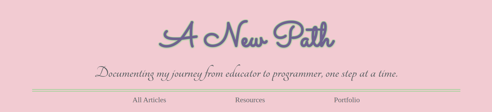

***User Footer***

The footer is also seen on every page of the website. The footer has a text section and links to all the pages in the site, as well as the external portfolio site.

***User Homepage:***

The homepage has three main sections, other than the header and footer. 

The first section has a link to my introduction blog post. The user can access the article by clicking the image that shows the blog post's name. 

The second section has a form for users to subscribe to receive email updates when new blog articles are posted.

The third section has images and text that also link to the view all articles page, resource page, and external portfolio site. The images grow slightly when hovered to indicate that they are clickable to the user.

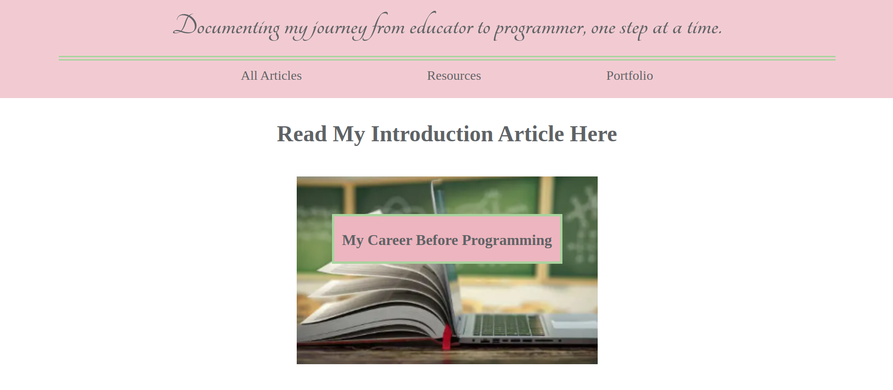
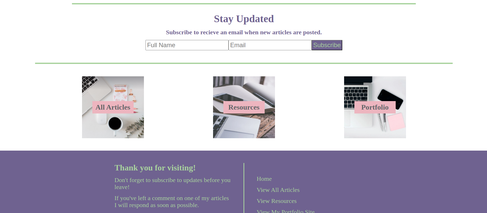

***User All Articles Page***

The All Articles page has a simple card for each blog entry. The user will click the article they would like to read and be directed to that article's detail page.

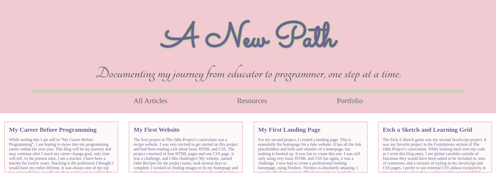
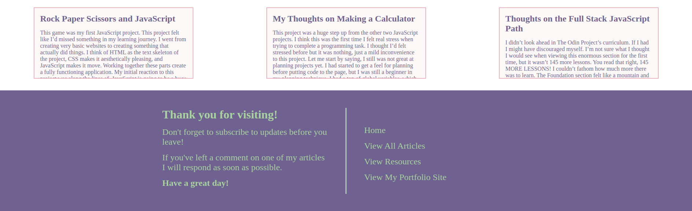

***User Article Detail Page***

After clicking on an article card the user is directed to the article details page. The articles detail page will show the title of the article, the article text, a comment form for users to leave a comment, and the comments the admin has chosen to publish. Any user can leave a comment but the comment will not appear on the page till the admin has published it from their site.

I have not screenshot the entire article text for the README to conserve space. I will add new blog articles as I have time to create them.

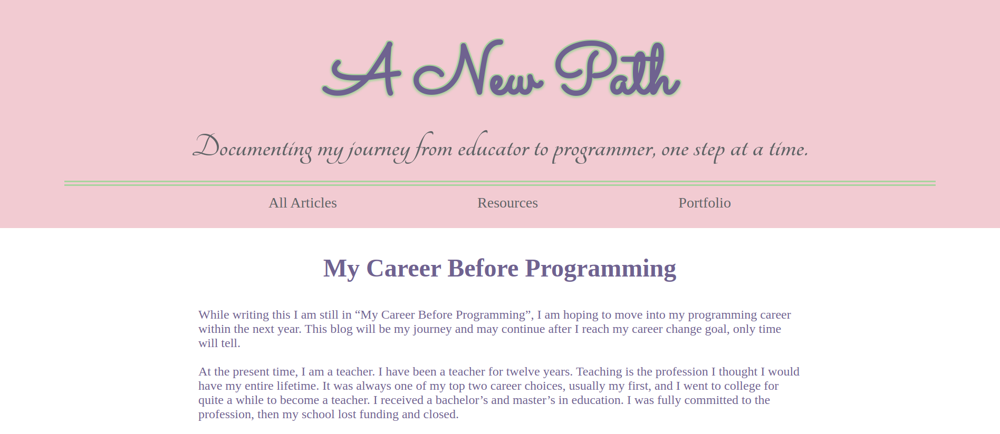
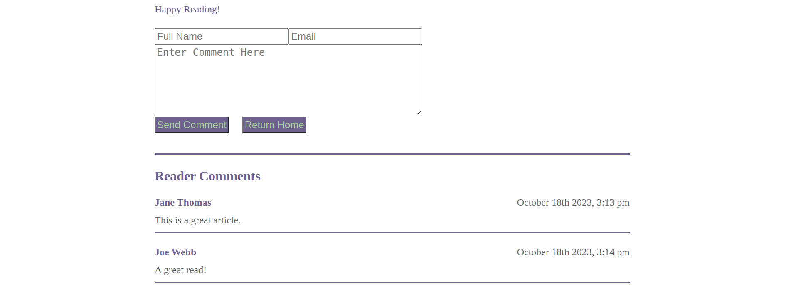

***User Resources Page***

The resources page tells users about websites that I found useful during my programming journey, this will be updated periodically as I find new resources. Each resource title links to the external site where the user can access the resource. 

Not all resources are shown in the README to conserve space. 

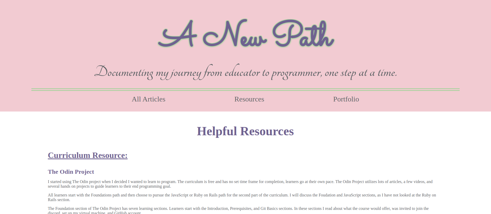
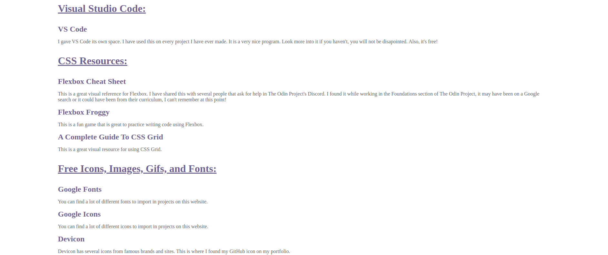
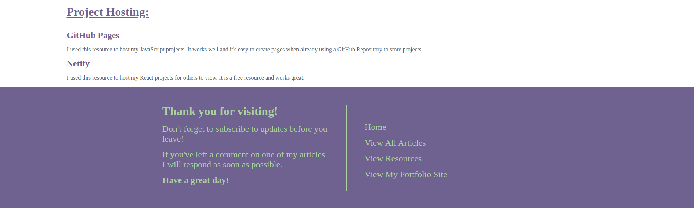

**React Admin Frontend Website**

The admin site is a bit less flashy than the user. This site will be used by only myself and is meant to be more functional than visually appealing. I did style it but it is not as styled as the user view.

The admin site allows myself to create, read, update, and delete the articles. I can also publish, unpublish, and delete user comments as I see fit. When the user submits a comment on an article it is sent to the database and renders on my admin site for approval.

The homepage of the admin site has a create article button that routes to the form to create a new article. I can also click on any current article to open the article detail page.

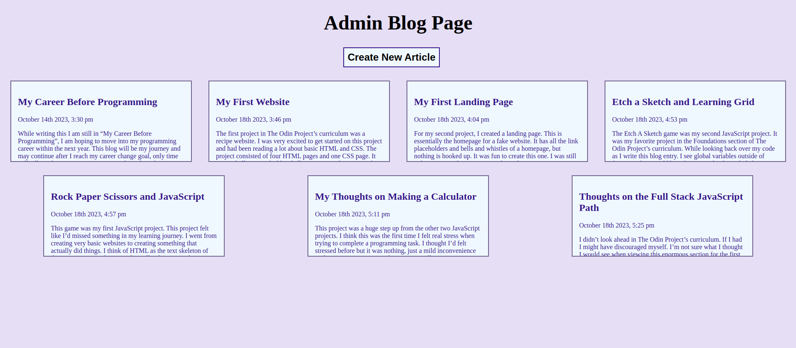
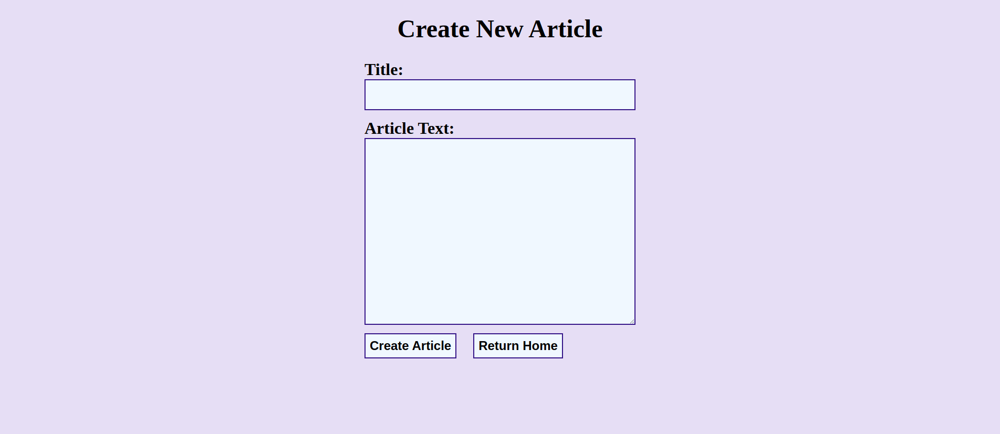

On the article detail page I am given the option to read, update, and delete the article. I also am able to view the submitted user comments on the article and publish, unpublish, or delete the comment on this page.

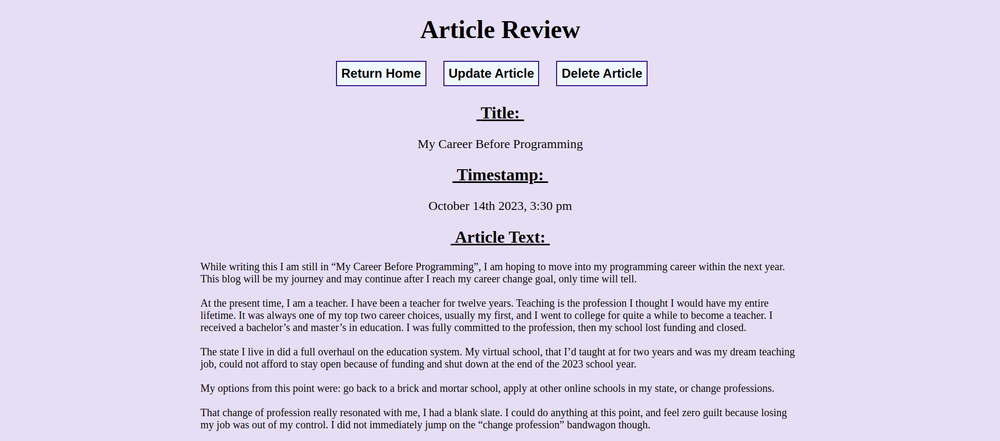
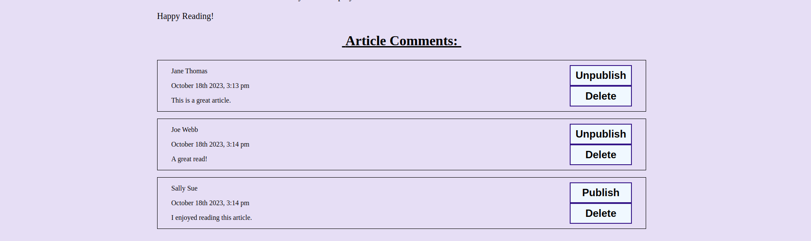

**The Backend Site**

The backend was created using Express. I created routes, controllers, and models to use with the MongoDB database and in my API calls from the React frontend websites.

***Credits***
1. Homepage Images: Pixaby and Pexels

2. Tab Icons: Bootstrap

3. Date/Time Formatting: Moment.js and Luxon

